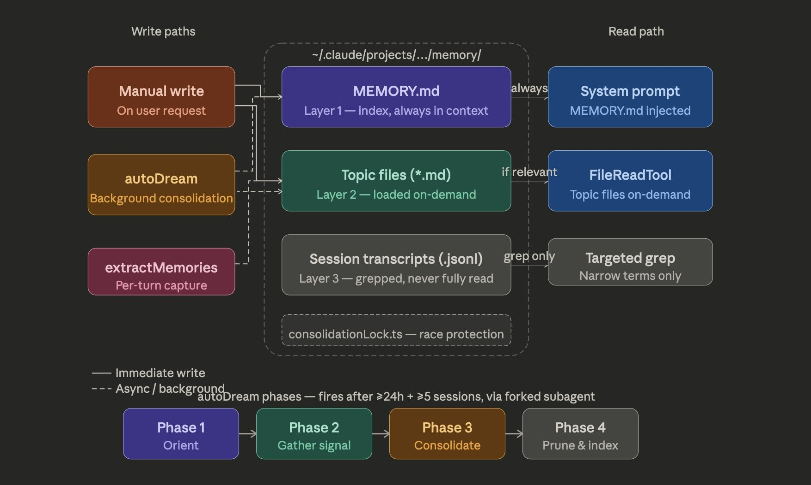
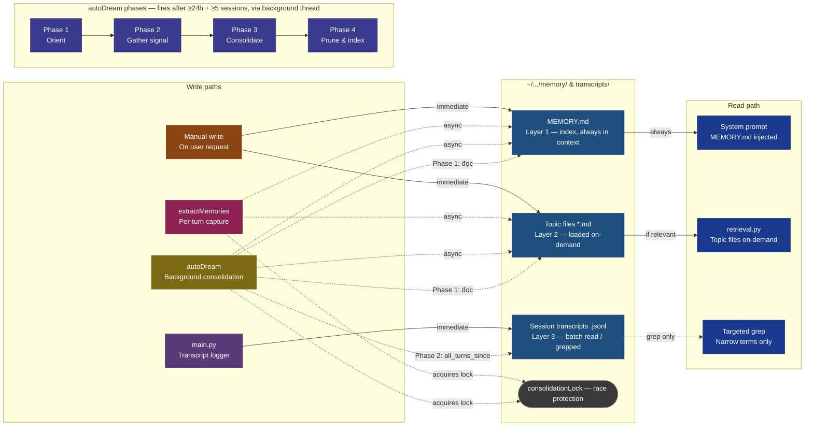

# Memory Chatbot

Chatbot với hệ thống bộ nhớ dài hạn 3 tầng, tự động lưu trữ và tổng hợp fact về người dùng qua các session.

---

## Mục lục

1. [Kiến trúc hệ thống](#kiến-trúc-hệ-thống)
2. [3 tầng lưu trữ](#3-tầng-lưu-trữ)
3. [Cơ chế ghi](#cơ-chế-ghi)
4. [Cơ chế đọc](#cơ-chế-đọc)
5. [Cơ chế lock](#cơ-chế-lock)
6. [Cấu trúc thư mục](#cấu-trúc-thư-mục)
7. [Lệnh](#lệnh)
8. [Cài đặt & chạy](#cài-đặt--chạy)
9. [Test & Eval](#test--eval)
10. [Điểm yếu đã biết](#điểm-yếu-đã-biết)
11. [Research](#research)

---

## Kiến trúc hệ thống

### Diagram gốc


### Diagram cập nhật



---

## 3 tầng lưu trữ

| Layer | File | Vai trò | Khi nào đọc |
|-------|------|---------|------------|
| 1 | `MEMORY.md` | Index tóm tắt toàn bộ topic | Mỗi lượt chat — luôn luôn |
| 2 | `*.md` (topic files) | Chi tiết từng chủ đề | Khi query có keyword trùng |
| 3 | `*.jsonl` (transcripts) | Lịch sử chat thô | `/search` hoặc autoDream Phase 2 |

**Tại sao 3 tầng?**

- **Layer 1 (luôn đọc):** MEMORY.md nhỏ gọn — chỉ chứa danh sách topic + hook 1 dòng. Inject vào mỗi lượt chat không tốn nhiều token, bot luôn biết "mình đã biết gì".
- **Layer 2 (đọc khi cần):** Topic file có thể dài. Chỉ load khi query liên quan — tránh nhồi context thừa.
- **Layer 3 (grep only):** Transcript là raw data, rất dài. Không bao giờ đọc toàn bộ — chỉ grep từ khóa hẹp (`/search`) hoặc autoDream đọc batch có filter timestamp.

---

## Cơ chế ghi

Có 4 write path, mỗi cái có mục đích và timing khác nhau:

### 1. main.py — Transcript logger

Mỗi lượt chat, ghi toàn bộ hội thoại vào `.jsonl` ngay lập tức (sync), độc lập với việc có fact hay không.

```
user_input → chat_model.invoke() → response
  ↓ (sau khi có response)
transcript_store.append_turn(session_id, "user", user_input)
transcript_store.append_turn(session_id, "assistant", answer)
```

### 2. extractMemories — Per-turn (async)

Sau mỗi lượt chat, spawn một `threading.Thread` hỏi LLM **"có fact nào đáng lưu không?"**:

```
LLM classifier trả về JSON:
  should_save: true  → acquire lock → read existing → merge in RAM → write topic + update MEMORY.md
  should_save: false → bỏ qua
```

- Chạy **async** — không chặn user nhập tiếp
- Chỉ thấy 1 turn → đôi khi bỏ sót fact trải dài nhiều turn
- Append vào topic cũ nếu slug đã tồn tại (không ghi đè)

### 3. Manual write — `/remember` và `/forget`

User chủ động ra lệnh lưu hoặc xóa:

**`/remember <nội dung>`:**
```
LLM phân loại topic (slug, title, hook, content)
  → acquire lock
  → đọc topic cũ (nếu có)
  → merge nội dung trong RAM
  → ghi đè toàn bộ file
  → cập nhật MEMORY.md
```
Luôn luôn lưu, không từ chối. **Không tự giải conflict** — nếu fact mới mâu thuẫn fact cũ, cả 2 đều được giữ. autoDream Phase 3 sẽ prune sau.

**`/forget <chủ đề>`:**
```
LLM xác định slug phù hợp
  → acquire lock
  → xóa topic file
  → rewrite MEMORY.md (bỏ entry tương ứng)
```

### 4. autoDream — Batch consolidation (async)

Chạy khi khởi động app, nếu đủ **2 điều kiện đồng thời**: ≥24h kể từ lần cuối AND ≥5 session mới.

| Phase | Tên | Làm gì |
|-------|-----|--------|
| Phase 1 | Orient | Đọc toàn bộ MEMORY.md + tất cả topic files hiện có |
| Phase 2 | Gather signal | Đọc tất cả lượt chat mới từ `.jsonl` kể từ lần cuối chạy |
| Phase 3 | Consolidate | LLM hợp nhất signal mới với memory cũ, tạo/cập nhật topic |
| Phase 4 | Prune & index | Xóa topic trùng/lỗi thời, viết lại toàn bộ MEMORY.md |

**Tại sao ≥24h + ≥5 session?**
- **≥24h:** Tránh chạy quá thường khi chưa có đủ signal mới. Lấy cảm hứng từ memory consolidation trong giấc ngủ (neuroscience).
- **≥5 session:** Cần đủ turns để LLM có context xác định pattern. 1–2 session thường quá ít để xuất hiện fact đáng consolidate.
- **AND (không phải OR):** Tránh trigger sau kỳ nghỉ dài (chỉ đủ giờ), tránh trigger quá thường dù user chat nhiều trong 1 ngày (chỉ đủ session).

**So sánh extractor vs autoDream:**

| | extractor | autoDream |
|--|-----------|-----------|
| Timing | Ngay sau mỗi turn | Batch định kỳ |
| Context | 1 turn | Tất cả turns từ lần cuối |
| Chất lượng | Trung bình (thiếu context) | Cao (thấy toàn bộ pattern) |
| Dùng khi | Fact quan trọng cần lưu ngay | Pattern dần hiện ra qua nhiều session |

---

## Cơ chế đọc

```
User gõ tin nhắn
       ↓
build_system_prompt(query)
       ├─ đọc MEMORY.md          → luôn inject vào system prompt (layer 1)
       └─ retrieval.py           → so keyword query với hook + title của từng topic
              ├─ có overlap ≥ 1  → đọc topic file → append vào prompt (layer 2)
              └─ không match     → bỏ qua
       ↓
chat_model.invoke(messages) → bot trả lời
```

**Cách retrieval hoạt động:**

1. Tokenize query (lowercase, bỏ stopwords: "tôi", "là", "và", "có", ...)
2. Với mỗi topic trong MEMORY.md: tokenize `hook + title`
3. Tính số từ overlap giữa query tokens và topic tokens
4. Topic có overlap ≥ 1 → load chi tiết, sort by overlap descending
5. Chỉ inject tối đa `max_topics` (default 3) topic vào context

**Ví dụ:**
```
Query: "tôi ăn tôm được không"
Tokens sau bỏ stopword: {"ăn", "tôm", "được"}

Topic "Dị ứng thực phẩm", hook: "dị ứng tôm bò"
Hook tokens: {"dị", "ứng", "tôm", "bò"}
Overlap: {"tôm"} = 1 → MATCH → load topic detail
```

> **Điểm yếu:** Nếu query dùng từ khác nghĩa ("beef" thay vì "bò") sẽ MISS. Fix cần vector embeddings (semantic search).

---

## Cơ chế lock

`extractMemories` và `autoDream` đều ghi vào cùng file → nếu cả 2 đọc file vào RAM cùng lúc trước khi ai kịp ghi → **race condition**: một bên ghi đè mất dữ liệu của bên kia.

**Giải pháp:** `.consolidation.lock`

---

## Cấu trúc thư mục

```
memory_chatbot/
├── main.py                     # Entry point, chat loop, transcript logger
├── config.py                   # Paths, model config, thresholds
├── state.py                    # autoDream trigger logic (should_run, mark_ran)
├── llm_client.py               # LangChain NVIDIA wrapper
│
├── memory/
│   ├── __init__.py             # Re-export tất cả submodules
│   ├── core/
│   │   ├── paths.py            # Slugify, ensure_dirs
│   │   └── lock.py             # File-based consolidation lock
│   ├── store/
│   │   ├── index_store.py      # Đọc/ghi MEMORY.md (layer 1)
│   │   ├── topic_store.py      # Đọc/ghi topic *.md (layer 2)
│   │   └── transcript_store.py # Append/grep .jsonl (layer 3)
│   ├── read/
│   │   └── retrieval.py        # Keyword-overlap retrieval
│   └── write/
│       ├── extractor.py        # Per-turn extraction (async thread)
│       ├── autodream.py        # Batch consolidation (4 phases)
│       └── manual_write.py     # /remember, /forget
│
├── data/
│   ├── memory/                 # MEMORY.md + topic *.md files
│   ├── transcripts/            # Session *.jsonl files
│   └── state.json              # autoDream state (last_run, session_count)
│
├── test/
│   ├── conftest.py             # Fixtures: tmp_path, monkeypatch, langchain stub
│   ├── test_index_store.py
│   ├── test_topic_store.py
│   ├── test_transcript_store.py
│   ├── test_retrieval.py
│   ├── test_extractor.py
│   ├── test_manual_write.py
│   ├── test_lock.py
│   ├── test_state.py
│   ├── test_paths.py
│   └── eval/
│       ├── eval_memory_quality.py   # Eval tầng 2: lưu đúng không?
│       ├── eval_retrieval.py        # Eval tầng 3: kéo đúng không?
│       └── eval_end_to_end.py       # Eval tầng 4: bot dùng đúng không?
│
└── docs/
    ├── TEST-REPORT.md          # Kết quả unit tests
    └── EVAL-REPORT.md          # Kết quả eval scripts
```

---

## Lệnh

| Lệnh | Tác dụng |
|------|---------|
| `/remember <nội dung>` | Lưu thủ công vào memory, phân loại topic bằng LLM |
| `/forget <chủ đề>` | Xóa topic khỏi memory (file + index) |
| `/search <từ khóa>` | Tìm trong lịch sử chat (grep .jsonl) |
| `/exit` | Thoát, chờ extractor threads hoàn thành |

---

## Cài đặt & chạy

```bash
# Cài dependencies
pip install -r requirements.txt

# Tạo file .env
cp .env.example .env
# Điền NVIDIA_API_KEY vào .env

# Chạy chatbot
python main.py
```

---

## Test & Eval

### Unit tests (57 tests)

Kiểm tra từng module hoạt động đúng về mặt code. Mỗi test chạy trong thư mục tạm riêng, không đụng data thật.

```bash
python -m pytest test/ -v
```

| File | Tests | Kiểm tra gì |
|------|-------|------------|
| `test_index_store.py` | 7 | Đọc/ghi/parse MEMORY.md |
| `test_topic_store.py` | 7 | Đọc/ghi/xóa topic files |
| `test_transcript_store.py` | 7 | Append/grep .jsonl |
| `test_retrieval.py` | 7 | Keyword overlap retrieval |
| `test_extractor.py` | 7 | Per-turn JSON extraction + write |
| `test_manual_write.py` | 5 | /remember, /forget |
| `test_lock.py` | 4 | Acquire/release/timeout |
| `test_state.py` | 6 | autoDream trigger conditions |
| `test_paths.py` | 7 | Slugify |

### Eval scripts (16 tests)

Kiểm tra sản phẩm hoạt động đúng từ góc nhìn người dùng. Không gọi LLM thật.

```bash
python test/eval/eval_memory_quality.py   # 5/5: lưu đúng, không trùng, forget sạch
python test/eval/eval_retrieval.py        # 6/6: keyword hit/miss, ranking, max_topics
python test/eval/eval_end_to_end.py       # 5/5: memory được inject đúng vào prompt
```

Xem chi tiết kết quả tại [`docs/TEST-REPORT.md`](docs/TEST-REPORT.md) và [`docs/EVAL-REPORT.md`](docs/EVAL-REPORT.md).

---

## Điểm yếu đã biết

| Vấn đề | Tác động | Fix đề xuất |
|--------|---------|------------|
| Synonym miss trong retrieval | Hỏi "beef" → bỏ sót topic "bò" | Thay keyword overlap bằng vector embeddings |
| extractor chỉ thấy 1 turn | Fact trải nhiều turn bị bỏ sót | Truyền sliding window N turn gần nhất |
| manual_write không giải conflict | Fact mâu thuẫn cùng tồn tại đến khi autoDream chạy | Prompt LLM hỏi "có mâu thuẫn không?" khi write |
| Retrieval không dùng timestamp | Fact cũ và mới được đối xử như nhau | Boost score cho fact gần đây (recency decay) |

---

## Research

Dự án được thiết kế dựa trên các nghiên cứu:

- **MemGPT** (Packer et al., 2023) — kiến trúc 3 tầng lưu trữ (RAM / disk / recall)
- **Generative Agents** (Park et al., 2023) — reflection mechanism → autoDream
- **Memory Survey** (Zhang et al., 2024) — phân loại episodic vs semantic memory
- **Sleep-Consolidated Memory** — batch consolidation định kỳ thay vì liên tục
- **CoALA** (Sumers et al., 2023) — incremental / batch / explicit learning

Xem đầy đủ tại [`Research.html`](Research.html).
